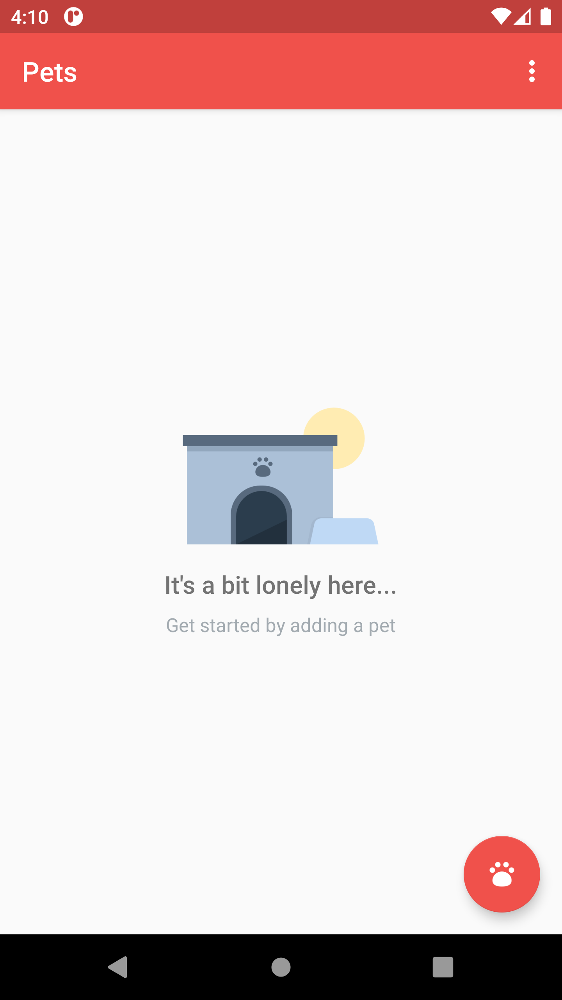
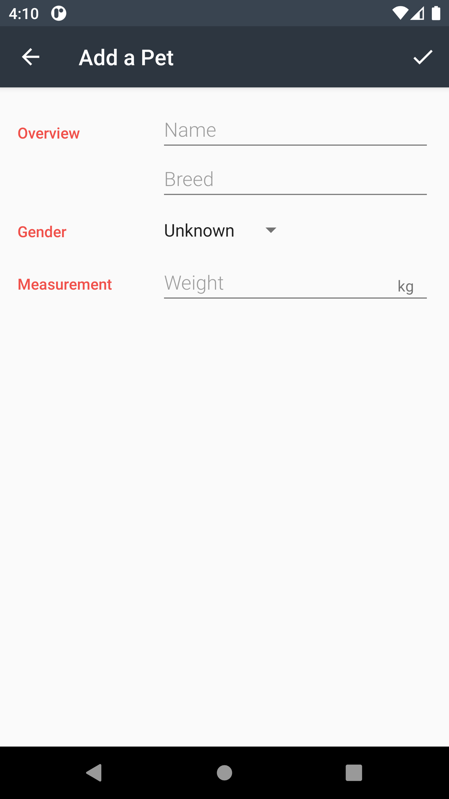
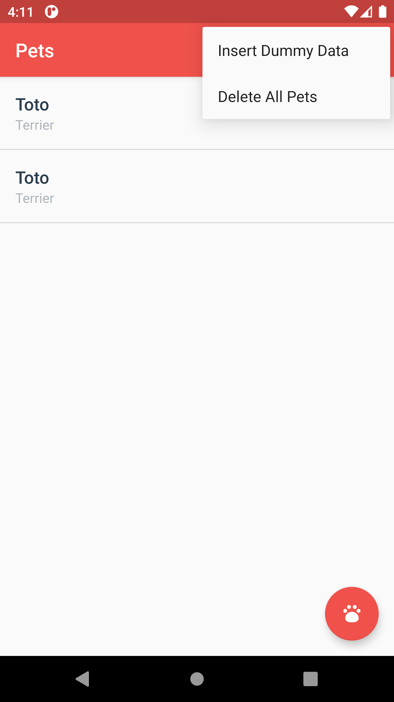

## Pets - Udacity - Data Storage - Project

### Project Overview

This app simulates storing a list of pets in a shelter using a local database. The pets can be added, removed and modified from the list.

### Screenshots

